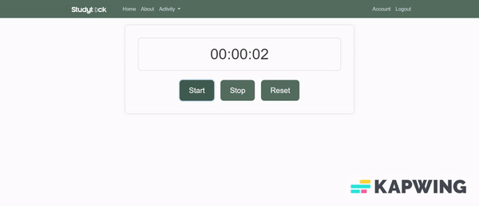
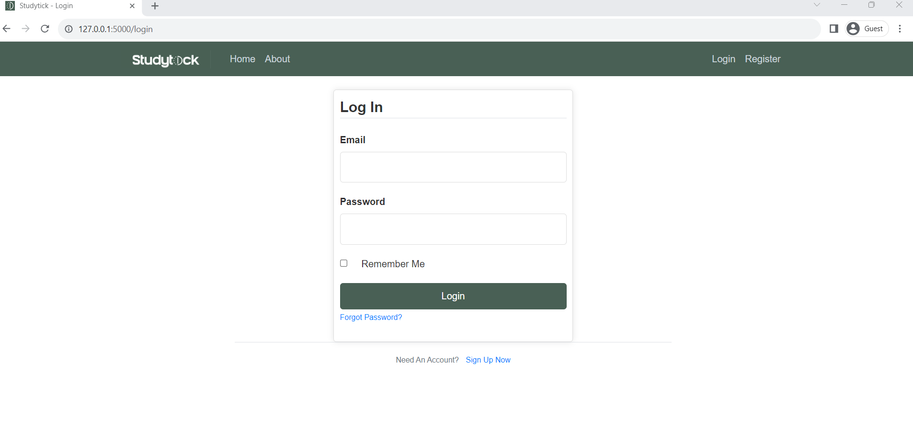
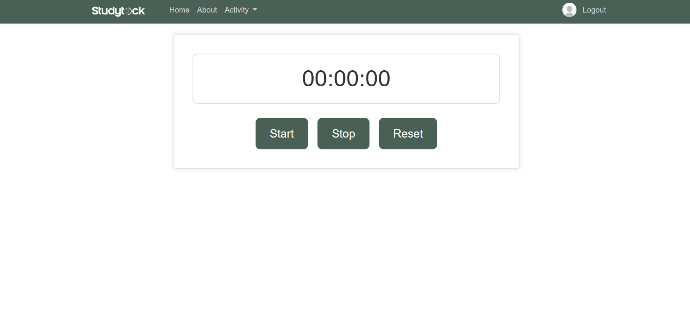
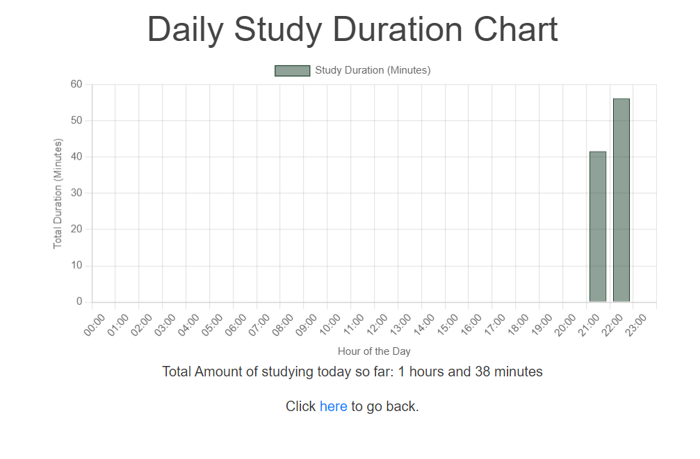
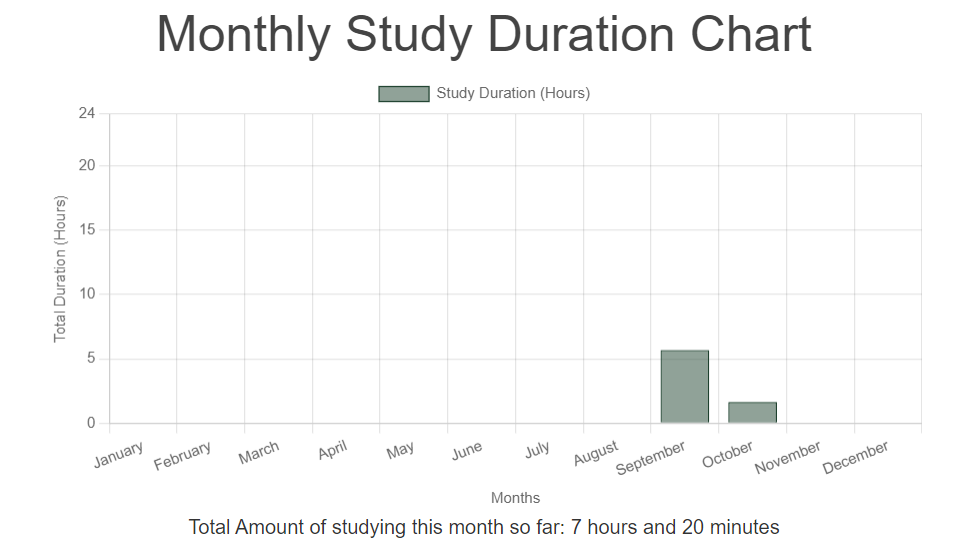

# StudyTick

StudyTick is a web application that helps you track the duration of your study sessions. It's built with Flask, JavaScript, HTML and CSS.

(Recording has been sped up and trimmed for the purpose of providing a simple demonstration)

## Features

- Integrated stopwatch for tracking study duration, helping you maintain focus and discipline.
- Stores data in a SQL database, ensuring your progress is saved and accessible whenever you need it.
- Visualises your study habits, you can view charts that provide insights into your daily, weekly, monthly, and yearly study durations.

  

## Login Page

The login page is created with Flask web forms, allowing users to sign in or register for an account.

## Home Page

The homepage is where you can utilise a timer to track how long you study for.

## Charts

Heres an example of a chart for the current day.

You can also view a chart for the current week, month and even year!

## Account Page
